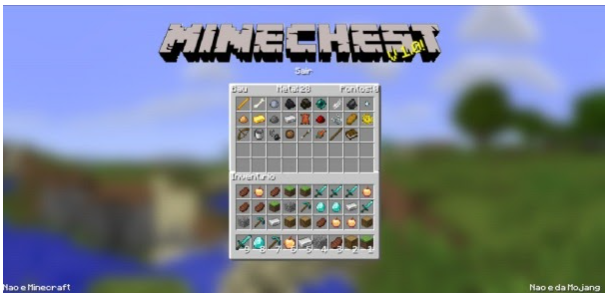

---
title: Projeto MineChest
layout: template
filename: MineChest
button: MineChest
blocker: 0
--- 
<html>
<body>
<h1 style="font-size:30px">
Oficina de Desenvolvimento de Aplicação Web em Python
</h1>
	

<b style="font-weight: bold;">Resenha </b>
Considere que a cada vez que você acessar o seu perfil, você tem direito a um sorteio de bônus, que podem ser usados para adquirir itens de um inventário para o seu baú. 
A partir dos bônus disponíveis, você deve selecionar os itens do inventário, maximizando a quantidade de itens do baú.
A oficina abordará o desenvolvimento do front e do backend do jogo, com as seguintes tecnologias: Python (e o framework Django), HTML, CSS e JavaScript.	

	

	
	

	<b style="font-size:20px;">Atividade prévia VSCode e Python</b>

	<a href="https://e2pc.github.io/ProjectPage/AtividadePrevia">Roteiro</a> para download e instalação

	

<b style="font-weight: bold;"><a href="https://e2pc.github.io/ProjectPage/Encontro1">1° Encontro</a>: 14/09: </b>
	Introdução ao Python, ao framework Django, à arquitetura MVT e configurações do projeto

	

<b style="font-weight: bold;"><a href="https://e2pc.github.io/ProjectPage/Encontro2">2° Encontro</a>: </b>
	Criação das telas base do projeto 

<b style="font-weight: bold;"><a href="https://e2pc.github.io/ProjectPage/Encontro3">3° Encontro</a>: </b>
	Implementação da autenticação do sistema com o django allauth  
	
	

	<b style="font-weight: bold;"><a href="https://e2pc.github.io/ProjectPage/Encontro4">4° Encontro</a>: </b>
	Desenvolver a interface mostrando tudo estilizado minecraft
	(seus locais/arquivos de configurações) 

<b style="font-weight: bold;"><a href="https://e2pc.github.io/ProjectPage/Encontro57">5° até 7° Encontro</a>: </b>
	Funções drag and drop, itens/imagens aleatórios(as) e somar os valores do baú 

</body>
</html>
