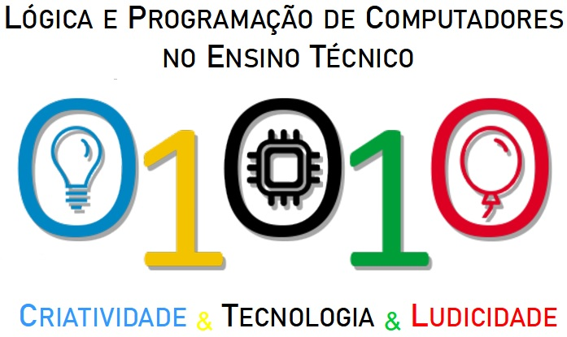

---
title: Ensino Extracurricular de Programação de Computadores
layout: template
filename: index
button: Inicio
blocker: 0
--- 

<html>
	<body>
		
		

			O Projeto de Extensão “Treinamento em Lógica e Programação de Computadores no Ensino Técnico”, vinculado ao Departameno de Ciência da Computação da Unicentro (Guarapuava, PR), é destinado aos alunos do ensino técnico em Informática dos colégios estaduais do município de Guarapuava (Colégios Francisco Carneiro Martins e Ana Vanda Bassara).
		

			Por meio de atividades que incluem oficinas, treinamentos e monitorias, o objetivo do projeto é introduzir os conceitos e melhorar as habilidades em lógica, metodologias e linguagens de programação de computadores dos participantes.
		

			O projeto pretende estimular a participação dos alunos na Olimpíada Brasileira de Informática (OBI) e pode ser estendido a outros estabelecimentos de ensino médio.
		

		<ul class="a">
			
		</ul>
		

			<b>EQUIPE:</b> 
			Ana Elisa Tozetto Piekarski da Palma 
			Mauro Miazaki 
			Alexandro Luis da Rocha Junior 
			Eric Patrick Militão 
			João Vitor Pieczarka da Silva 
		

		

			Contato: e2pc@unicentro.br
		

	</body>
</html>
