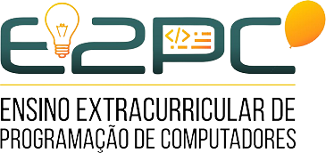

### Publicações

[MILITÃO, E. P.]; [SILVA, J. V. P.]; [ROCHA JUNIOR, A. L.]; [PIEKARSKI, A. E. T.]; [MIAZAKI, M.] [Oficinas Remotas com a Plataforma Code.org para o Ensino Técnico em Informática.] In: XIV EAEX - Encontro Anual de Extensão da UNICENTRO, 2021, Online. Anais..., 2021.  

[ROCHA JUNIOR, A. L.]; [MILITÃO, E. P.]; [SILVA, J. V. P.]; [PIEKARSKI, A. E. T.]; [MIAZAKI, M.] [Proposta de Oficina de Desenvolvimento Web com Python para o Ensino Técnico em Informática.] In: XIV EAEX - Encontro Anual de Extensão da UNICENTRO, 2021, Online. Anais..., 2021.  

PRESTES, M. A.; [ROCHA JUNIOR, A. L.]; [PIEKARSKI, A. E. T.]; [MIAZAKI, M.] Programação em Blocos: [A Experiência do Projeto "Treinamento em Lógica e Programação de Computadores".] In: XIII EAEX - Encontro Anual de Extensão da UNICENTRO, 2020, Online. Anais..., 2020. v. 3.  

SILVA, E. A.; [PIEKARSKI, A. E. T.] [A Influência de Atividades Externas para a Formação Acadêmica: A Experiência da Maratona de Programação para os Calouros.] In: XIII EAEX - Encontro Anual de Extensão da UNICENTRO, 2020, Online. Anais..., 2020. v. 3.

PRESTES, M. A.; GARDIN, H.; URTADO, J. V. M.; [PIEKARSKI, A. E. T.];[ MIAZAKI, M.] [Oficinas de Greenfoot no Ensino Técnico de Informática.] In: VI Semana de Integração Ensino, Pesquisa e Extensão - SIEPE, 2019, Guarapuava. Anais do 12º Encontro Anual de Extensão e Cultura, EAEX. Guarapuava: Unicentro, 2019.

GARDIN, H.; URTADO, J. V. M.; PRESTES, M. A.; [PIEKARSKI, A. E. T.]; [MIAZAKI, M.] [Quizz como Ferramenta de Avaliação nos Treinamentos de Programação de Computadores para o Ensino Técnico.] In: VI Semana de Integração Ensino, Pesquisa e Extensão - SIEPE, 2019, Guarapuava. Anais do 12º Encontro Anual de Extensão e Cultura, EAEX. Guarapuava: Unicentro, 2019.

GARDIN, H.; URTADO, J. V. M.; PRESTES, M. A.; [PIEKARSKI, A. E. T.]; [MIAZAKI, M.]; HILD, T. A. [Ambientes de apoio às competições computacionais no projeto "Ensino Extracurricular de Programação de Computadores".] In: XI Encontro Anual de Extensão Universitária, 2018, Guarapuava. Anais..., 2018. v. 2.

[PIEKARSKI, A. E. T.]; HILD, T. A.; [MIAZAKI, M.]; GARDIN, H.; URTADO, J. V. M.; PRESTES, M. A. [Extensão para os cursos Ténicos de Informática em Guarapuava/PR: O caso das oficinas de Greenfoot.] In: 8º Congresso Brasileiro de Extensão Universitária, 2018, Natal. Anais... Natal: SEDIS-UFRN, 2018. v. 2. p. 2416-2429.

[PIEKARSKI, A. E. T.]; HILD, T. A.; [MIAZAKI, M.]; BINI, E. M.; GARDIN, H.; URTADO, J. V. M.; PRESTES, M. A. [Programação de computadores no ensino médio: o estímulo da Olimpíada Brasileira de Informática.] In: 8º Congresso Brasileiro de Extensão Universitária, 2018, Natal. Anais... Natal: SEDIS-UFRN, 2018. v. 2. p. 4679-4695.

DIDUR, L. F.; [PIEKARSKI, A. E. T.]; HILD, T. A. [Treinamentos em Estrutura de Dados no Projeto E2PC.] In: V Semana de Integração Ensino, Pesquisa e Extensão, 2017, Guarapuava. Anais..., 2017.

PADILHA, L.; DIDUR, L. F.; HILD, T. A.; [MIAZAKI, M.]; [PIEKARSKI, A. E. T.] [Plataforma de apoio ao treinamento para a Olimpíada Brasileira de Informática.] In: IX Salão de Extensão e Cultura, 2016, Guarapuava. Anais..., 2016. v. 5.

[PIEKARSKI, A. E. T.]; [MIAZAKI, M.]; HILD, T. A.; BINI, E. M. [Smart-me: Disseminação e Uso de TICs (Tecnologias da Informação e Comunicação).] In: IX Salão de Extensão e Cultura, 2016, Guarapuava. Anais..., 2016. v. 5.

PADILHA, L.; [MIAZAKI, M.]; HILD, T. A.; [PIEKARSKI, A. E. T.] [Organização e disponibilização dos conteúdos do projeto Ensino Extracurricular de Programação de Computadores.] In: IV Semana de Integração Ensino, Pesquisa e Extensão, 2015, Guarapuava. Anais..., 2015. v. 4.

[PIEKARSKI, A. E. T.]; [MIAZAKI, M.]; HILD, T. A.; MULATI, M. H.; KIKUTI, D. [A metodologia das maratonas de programação em um projeto de extensão: um relato de experiência.] In: I Workshop de Ensino em Pensamento Computacional, Algoritmos e Programação, 2015, Maceió. Anais dos Workshops do Congresso Brasileiro de Informática na Educação. Porto Alegre: Editora da Sociedade Brasileira de Computação, 2015.

[PIEKARSKI, A. E. T.]; KIKUTI, D.; MULATI, M. H.; [MIAZAKI, M.] [Ensino Extracurricular de Programação de Computadores.] In: 31º Seminário de Extensão Universitária da Região Sul, 2013, Florianópolis. Anais..., 2013.

GONCALVES, P. D.; LIMA, R. H. R.; [PIEKARSKI, A. E. T.]; KIKUTI, D.; MULATI, M. H.; [MIAZAKI, M.] [A metodologia de Maratonas de Programação no projeto Ensino Extracurricular de Programação de Computadores.] In: III Semana de Integração Ensino, Pesquisa e Extensão - SIEPE, 2013, Guarapuava. Anais..., 2013. v. 2.

[PIEKARSKI, A. E. T.]; KIKUTI, D.; PAVELSKI, L. M.; URIO, P. R.; BATISTA, A. D. [Ensino Extracurricular de Programação de Computadores.] In: II Semana de Integração Ensino, Pesquisa e Extensão - SIEPE, 2011, Guarapuava. Anais..., 2011.

<!-- Coloque aqui o link para os perfis no lattes -->
[ROCHA JUNIOR, A. L.]: http://lattes.cnpq.br/6114786229801553
[MILITÃO, E. P.]:  http://lattes.cnpq.br/4871957816560793
[SILVA, J. V. P.]: http://lattes.cnpq.br/8811154723091396
[PIEKARSKI, A. E. T.]: http://lattes.cnpq.br/2805611498433082
[MIAZAKI, M.]: http://lattes.cnpq.br/6722436779210499

<!-- Coloque aqui o link para a publicação -->
[Ensino Extracurricular de Programação de Computadores.]: https://e2pc.unicentro.br/assets/Articles/2011%20-%20II%20SIEPE.pdf
[A metodologia de Maratonas de Programação no projeto Ensino Extracurricular de Programação de Computadores.]: https://e2pc.unicentro.br/assets/Articles/2013 - III SIEPE.pdf
[Ensino Extracurricular de Programação de Computadores.]: https://e2pc.unicentro.br/assets/Articles/2013 - 31 SEURS.pdf
[A metodologia das maratonas de programação em um projeto de extensão: um relato de experiência.]: https://e2pc.unicentro.br/assets/Articles/2015%20-%20IV%20CBIE.pdf
[Organização e disponibilização dos conteúdos do projeto Ensino Extracurricular de Programação de Computadores.]: https://e2pc.unicentro.br/assets/Articles/2015%20-%20IV%20SIEPE.pdf
[Smart-me: Disseminação e Uso de TICs (Tecnologias da Informação e Comunicação).]: https://e2pc.unicentro.br/assets/Articles/2016%20-%209%20SEC%20(Smart-me).pdf
[Plataforma de apoio ao treinamento para a Olimpíada Brasileira de Informática.]: https://e2pc.unicentro.br/assets/Articles/2016%20-%209%20SEC%20(OBI).pdf
[Treinamentos em Estrutura de Dados no Projeto E2PC.]: https://e2pc.unicentro.br/assets/Articles/2017%20-%20V%20SIEPE.pdf
[Programação de computadores no ensino médio: o estímulo da Olimpíada Brasileira de Informática.]: https://e2pc.unicentro.br/assets/Articles/2018%20-%208%20CBEU%20(OBI).pdf
[Extensão para os cursos Ténicos de Informática em Guarapuava/PR: O caso das oficinas de Greenfoot.]: https://e2pc.unicentro.br/assets/Articles/
[Ambientes de apoio às competições computacionais no projeto “Ensino Extracurricular de Programação de Computadores”.]: https://e2pc.unicentro.br/assets/Articles/2018%20-%20XI%20EAEX.pdf
[Quizz como Ferramenta de Avaliação nos Treinamentos de Programação de Computadores para o Ensino Técnico.]: https://e2pc.unicentro.br/assets/Articles/2019%20-%20VI%20SIEPE%20(OBI).pdf
[Oficinas de Greenfoot no Ensino Técnico de Informática.]: https://e2pc.unicentro.br/assets/Articles/2019%20-%20VI%20SIEPE%20(Greenfoot).pdf
[A Influência de Atividades Externas para a Formação Acadêmica: A Experiência da Maratona de Programação para os Calouros.]: https://e2pc.unicentro.br/assets/Articles/2020%20-%20XIII%20EAEX%20(Maratona).pdf
[Programação em Blocos: A Experiência do Projeto “Treinamento em Lógica e Programação de Computadores”.]: https://e2pc.unicentro.br/assets/Articles/2020%20-%20XIII%20EAEX%20(Code).pdf
[Proposta de Oficina de Desenvolvimento Web com Python para o Ensino Técnico em Informática.]: https://e2pc.unicentro.br/assets/Articles/
[Oficinas Remotas com a Plataforma Code.org para o Ensino Técnico em Informática.]: https://e2pc.unicentro.br/assets/Articles/

