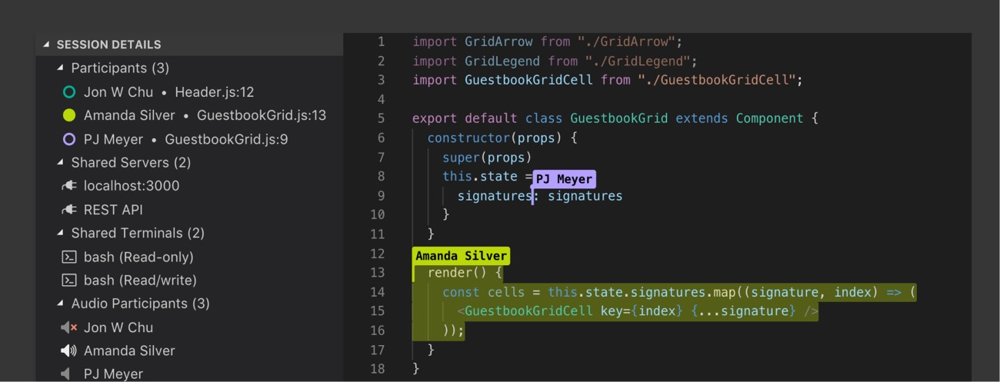
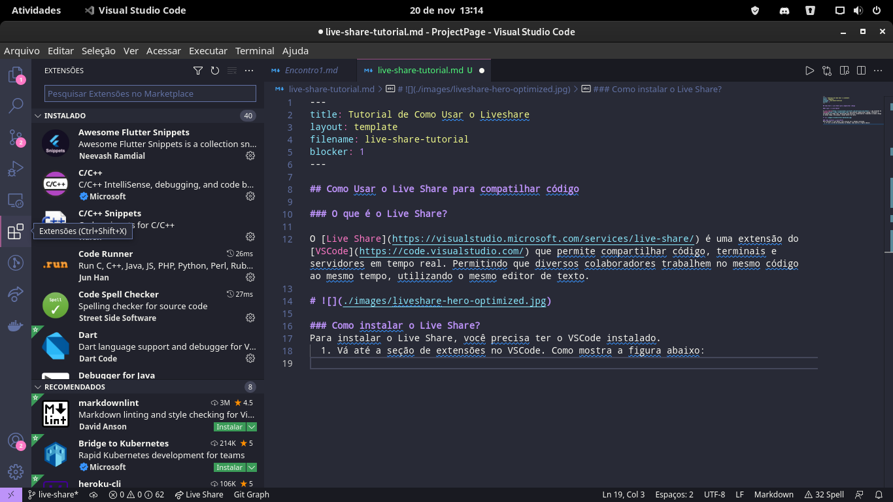
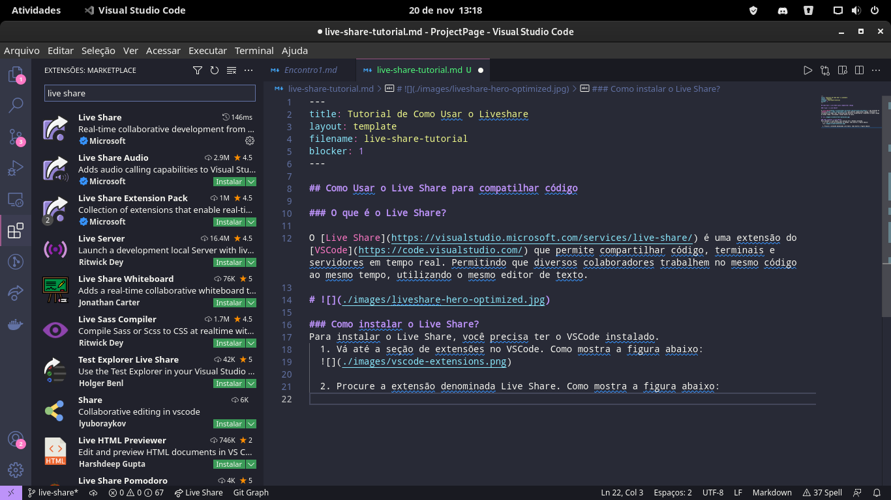
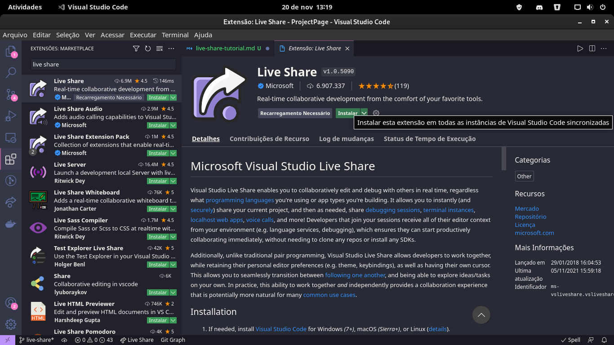
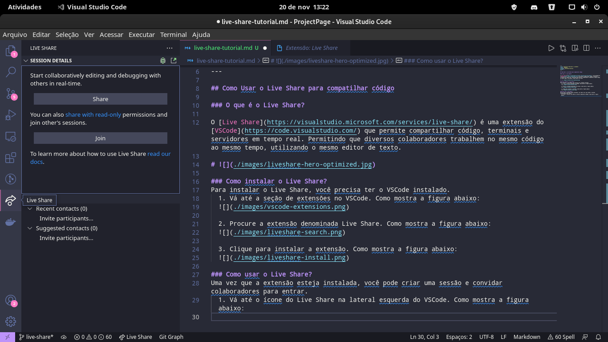
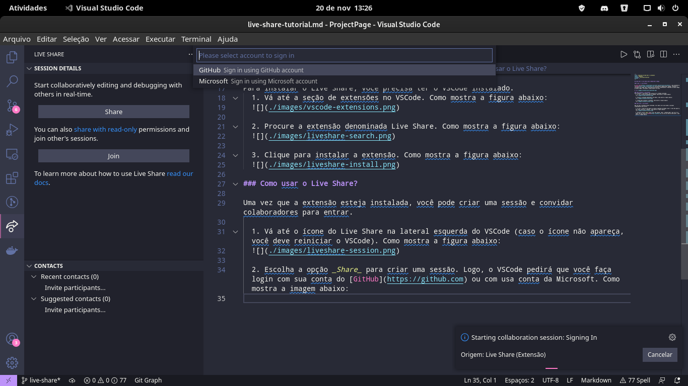
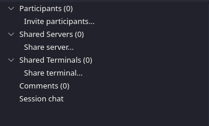
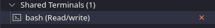

## Como Usar o Live Share para compatilhar código

### O que é o Live Share?

O [Live Share](https://visualstudio.microsoft.com/services/live-share/) é uma extensão do [VSCode](https://code.visualstudio.com/) que permite compartilhar código, terminais e servidores em tempo real. Permitindo que diversos colaboradores trabalhem no mesmo código, ao mesmo tempo. Utilizando o mesmo editor de texto.

# 

### Como instalar o Live Share?
Para instalar o Live Share, você precisa ter o VSCode instalado.
  
  1. Vá até a seção de extensões no VSCode. Como mostra a imagem abaixo:
  

  2. Procure a extensão denominada Live Share. Como mostra a imagem abaixo:
  

  3. Clique para instalar a extensão. Como mostra a imagem abaixo:
  

### Como usar o Live Share?

Uma vez que a extensão esteja instalada, você pode criar uma sessão e convidar colaboradores para entrar.
  
  1. Vá até o ícone do Live Share na lateral esquerda do VSCode (caso o ícone não apareça, você deve reiniciar o VSCode). Como mostra a imagem abaixo:
  

  2. Escolha a opção _Share_ para criar uma sessão. Logo, o VSCode pedirá que você faça login com sua conta do [GitHub](https://github.com) ou com usa conta da Microsoft. Como mostra a imagem abaixo. Depois que você efetuar login, a sessão será automaticamente criada.
  
  
  3. Para convidar colaboradores, escolha a opção _Invite participants_ no menu do Live Share. 
  

Após isso, será copiado um link que você pode mandar aos colaboradores. Quando um colaborador entrar no link, você deverá permitir e escolher se ele tem autorização para ler e/ou escrever.

### Opções adicionais

Seguindo os passos acimas, você criará uma sessão onde diversos colaboradores poderão trabalhar no código em tempo real. Porém, o Live Share conta com outras funcionalidades que podem ser úteis. Por exemplo, a opção de compartilhar um terminal. Como mostra a imagem abaixo:

Isso permite que os colaboradores possam compilar e executar os códigos usando um mesmo terminal compartilhado. 

Mais informações no site oficial do [Live Share](https://docs.microsoft.com/pt-br/visualstudio/liveshare/).