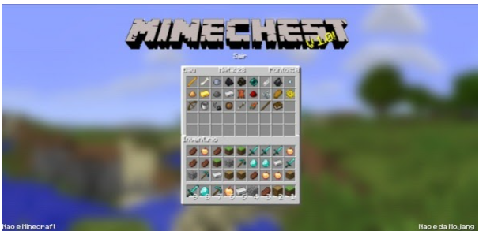

---
title: Projeto MineChest
layout: template
button: Mine Chest
filename: mine_chest_python
type: post
--- 
<h1 style="font-size:30px">
Oficina de Desenvolvimento de Aplicação Web em Python
</h1>
	

<b style="font-weight: bold;">Resenha </b>
Considere que a cada vez que você acessar o seu perfil, você tem direito a um sorteio de bônus, que podem ser usados para adquirir itens de um inventário para o seu baú. 
A partir dos bônus disponíveis, você deve selecionar os itens do inventário, maximizando a quantidade de itens do baú.
A oficina abordará o desenvolvimento do front e do backend do jogo, com as seguintes tecnologias: Python (e o framework Django), HTML, CSS e JavaScript.	

	
	

	<b style="font-weight: bold;"><a href="https://e2pc.unicentro.br/posts/ProjectPage/pages/minechest/AtividadePrevia">Atividade prévia</a>: </b> 
	Roteiro para download e instalação do ambiente de desenvolvimento - Visual Studio Code e Python

<b style="font-weight: bold;"><a href="https://e2pc.unicentro.br/posts/ProjectPage/pages/minechest/Encontro1">1° Encontro</a>: 14/09: </b>
	Introdução ao Python, ao framework Django, à arquitetura MVT e configurações do projeto

<b style="font-weight: bold;"><a href="https://e2pc.unicentro.br/posts/ProjectPage/pages/minechest/Encontro2">2° Encontro</a>: 21/09: </b>
	Criação das telas base e implementação do sistema de autenticação com Django Allauth 

<b style="font-weight: bold;"><a href="https://e2pc.unicentro.br/posts/ProjectPage/pages/minechest/Encontro3">3° Encontro</a>: 28/09: </b>
	Desenvolvimento da interface com o estilo do Minecraft 

	<b style="font-weight: bold;"><a href="https://e2pc.unicentro.br/posts/ProjectPage/pages/minechest/Encontro4">4° Encontro</a>: 05/10:  </b>
	Desenvolvimento do backend (funções para somar os pontos e mover os itens) 
	<b style="font-weight: bold;"><a href="ProjectPage/pages/minechest/AtividadePrevia">Atividade prévia</a>: </b> 
	Roteiro para download e instalação do ambiente de desenvolvimento - Visual Studio Code e Python

<b style="font-weight: bold;"><a href="ProjectPage/pages/minechest/Encontro1">1° Encontro</a>: 14/09: </b>
	Introdução ao Python, ao framework Django, à arquitetura MVT e configurações do projeto

<b style="font-weight: bold;"><a href="ProjectPage/pages/minechest/Encontro2">2° Encontro</a>: 21/09: </b>
	Criação das telas base e implementação do sistema de autenticação com Django Allauth 

<b style="font-weight: bold;"><a href="ProjectPage/pages/minechest/Encontro3">3° Encontro</a>: 28/09: </b>
	Desenvolvimento da interface com o estilo do Minecraft 

	<b style="font-weight: bold;"><a href="ProjectPage/pages/minechest/Encontro4">4° Encontro</a>: 05/10:  </b>
	Desenvolvimento do back-end (funções para somar os pontos e mover os itens) 

