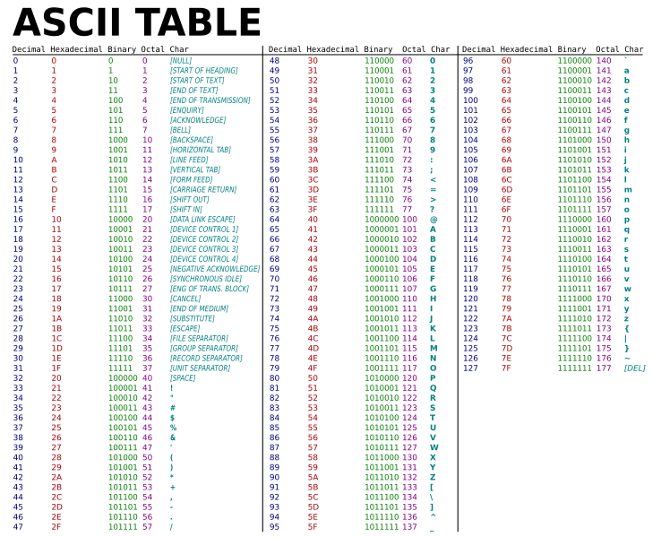

# String

Strings são sequências de caracteres alfanuméricos (letras, números e/ou símbolos), tambem chamado de cadeia de caracteres. Na computação uma string é representada por um vetor do tipo char, onde cada índice do vetor corresponde a um caractere da string.

Aqui podemos ver uma string:
<table class="table table-bordered">
    <thead>
        <tr>
            <th scope="col">Posição do vetor</th>
            <th scope="col">0</th>
            <th scope="col">1</th>
            <th scope="col">2</th>
            <th scope="col">3</th>
            <th scope="col">4</th>
        </tr>
    </thead>
    <tbody>
        <tr>
            <td>Caractere</td>
            <td>E</td>
            <td>2</td>
            <td>P</td>
            <td>C</td>
            <td>\0</td>
        </tr>
    </tbody>
</table>

Observe que:

- Posso acessar qualquer caractere da string com o índice do vetor (Em C++ sempre iniciando do zero)
- Uma string é delimitada por aspas duplas (Por exemplo: “Paulo”, “Maria”, “ ”).
- Cada caractere que constitui a string é delimitado por aspas simples (Por exemplo: ‘P’, ‘a’, ‘ ’)
- As strings são finalizadas com o **caractere** especial ‘\0’, chamado null byte.

Sintaxe:
<pre>
    <code class="language-cpp">
        string projeto = "D2PC";

        //<b>Imprimir um caractere do vetor:</b>
        cout << projeto[0];
        //<b>A saída será 'D'</b>

        //<b>Modificar o vetor</b>
        projeto[0] = 'E'

        cout << projeto[0];
        //<b>A saída será 'E'</b>

        //<b>Imprimir toda string:</b>
        cout << projeto;
        //<b>A saída será 'E2PC'</b>

        //<b>Imprimir toda a string acessando cada caractere:</b>
        for(int i=0;projeto[i]!='\0';i++){
            cout << projeto[i];
        }
        //<b>A saída será 'E2PC'</b>

        //<b>Comparando os caracteres da string:</b>
        if(projeto[0]=='E'){
            ...
        }
    </code>
</pre>

 

## Leitura de string

Normalmente é utilizado a instrução **cin** para leitura de string.
Sintaxe:

<pre>
    <code class="language-cpp">
    //<b>Leitura de string:</b>
    cin >> projeto;
    cout << projeto << endl;
    </code>
</pre>

## Outros métodos de leitura
Normalmente utilizamos **cin**, mas essa instrução tem uma limitação intencional, ela interrompe a leitura se encontrar um espaço.

Para permitir a leitura de conteúdos contendo espaços, é preciso utilizar outra função de entrada, que obterá toda a linha:

A instrução **getline(cin, projeto)** permitirá que todos os caracteres, até o enter, que forem digitados sejam obtidos.

Se for necessário utilizar outro caractere para delimitar o fim do conteúdo da variável, esse caractere poderá ser especificado: 
**getline(cin, projeto, '.')**

Com essa instrução, todos os caracteres que antecedem o ponto ('.') serão armazenados na variável projeto.

<pre>
    <code class="language-cpp">
    /*

        <b>Entrada:</b> Cuidado.&#9;Getline em uso.
        (note que possui tabulação(TAB) no meio da string)
    
*/
        int main() {
            string a, b, c, d, e;

            getline(cin, a);
            cout << a << endl;
            //Saida: Cuidado.&#9;Getline em uso.
            cin.ignore(1)

            getline(cin, b, '.');
            cout << b << endl;
            //Saida: Cuidado

            getline(cin, c);
            cout << c << endl;
            //Saida: .&#9;Getline em uso.

            getline(cin, d, '\t');
            cout << d << endl;
            //Saida: Cuidado.

            cin >> e;
            cout << e;
            //Saida: &#9;Getline
            //"em uso" permanecerá no fluxo de entrada
        }
    </code>
</pre>
Note que:
- \t é um **caractere** especial que simboliza tabulação(TAB)
- **getline(cin, b, '.');** lê até o ponto, mas deixa os outros caracteres no fluxo de entrada, quando o **getline(cin, c);** lê, ele lerá oque está na vez no fluxo, podendo nao ser o valor esperado. Isso ocorre com o **getline(cin, a);** também, pois o getline lê até o enter, ou seja, deixa o enter no fluxo de entrada, então é necessario descartar o proximo caracter(enter) do fluxo da entrada para continuar o programa normalmente, isso que o cin.ignore(1) faz.

## Tabela ASCII
É o Código Padrão Americano para o Intercâmbio de Informação é um dos vários sistemas de representação de caracteres alfanuméricos. Além do computador ele é usado amplamente na internet para transferência de dados. 

   
    Observe que caracteres maiúsculo e minúsculo tem valores diferentes.

- Em C++ cada caractere ocupa, apenas, 1 byte(8 bits) na memória, isso ocorre porque ele utiliza o padrão ASCII. JavaScript, por exemplo, cada caractere utiliza 4 bytes(32 bits), pois utiliza o padrão UTF-8

No computador os caracteres são armazenados como números e interpretados como caracteres, como podemos ver a seguir:

<pre>
    <code class="language-cpp">
    string projeto = "E2PC"
    for(int i=0;projeto[i]!='\0';i++){
        cout << (int)projeto[i] << endl;
    }
    //A saída será '69 50 80 67'
    </code>
</pre>

Observe que **forçamos** a saída como inteira (**(int)projeto[i]**), mesmo sendo um caractere, isso se chama **casting explícito**. Atenção com o casting, pois ele forçará só o próximo elemento, não todos os outros, então utilize parênteses se precisar utilizar para mais de um elemento:
- (int)2.5 = 2
- (int)(2.5+3.2) = 5
- (int)2.5+3.2 = 5.2
- (char)69 = 'E'
- Pode ser feito com qualquer tipo de dado: (int), (double), (float), (char) e etc.

Como se trata de números podemos manipular os caracteres, como por exemplo, se em um lugar do vetor tivermos o caractere **A** e fizermos **A**+1, então a saída será **B**, porque na tabela **A** tem o valor 66, e 66+1 será **B**, pois 67 é **B** na tabela ASCII:

<pre>
    <code class="language-cpp">
    string projeto = "E2PC";

    cout << (char)('A'+1);
    //A saída será 'B'

    cout << (char)(projeto[0]+1);
    //A saída será 'F'

    cout << projeto[0]+1;
    //A saída será 70

    cout << (char)projeto[0]+1;
    //A saída será 70
    </code>
</pre>
Observe que sem o casting apropriado a saída será um valor inteiro.

### Problemas
- [Salário com Bônus](https://www.beecrowd.com.br/judge/pt/problems/view/1009?origem=1)
- [Criptografia](https://www.beecrowd.com.br/judge/pt/problems/view/1024?origem=1)
- [LED](https://www.beecrowd.com.br/judge/pt/problems/view/1168?origem=1)
- [Combinador](https://www.beecrowd.com.br/judge/pt/problems/view/1238?origem=1)