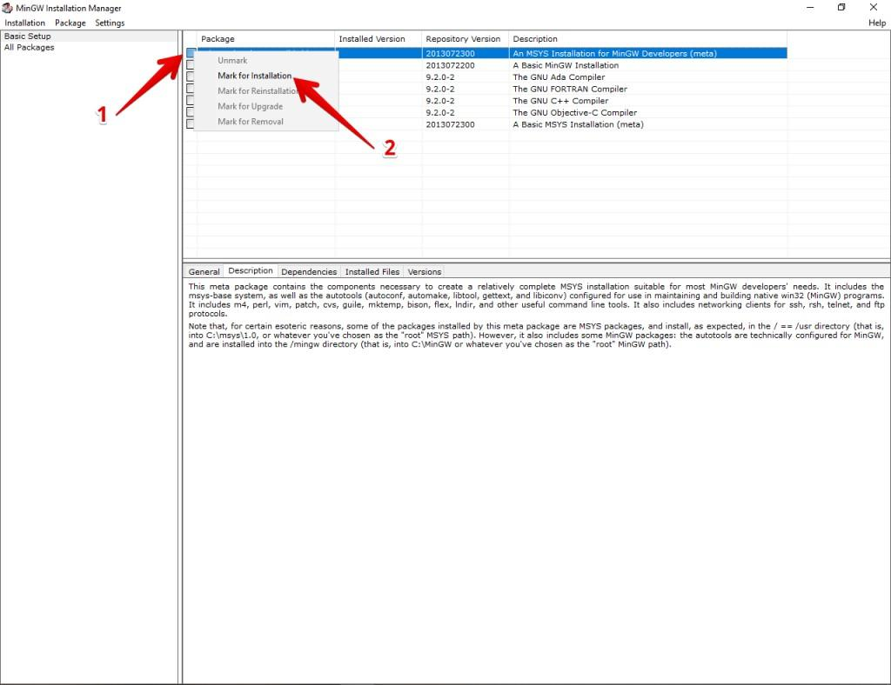
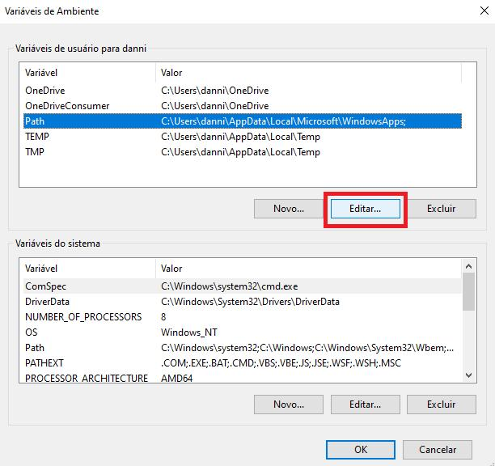

# Como instalar MingGW no Windows 10
Este tutorial traz o passo-a-passo de como fazer a instalação do MinGW no Windows 10. MingGW (Minimalist GNU for Windows) é uma versão minimalista do compilador GCC (GNU Compiler Collection) para linguagem C/C++ para Windows. Com o MinGW, é possível compilar programas escritos em C/C++ no sistema operacional Windows.
<br/>
Este tutorial está dividido em duas partes. **Parte 1** mostra o passo-a-passo de como fazer o download e instalação do MinGW. Enquanto que, a **Parte 2** mostra o passo-a-passo de como fazer a configuração da variável de ambiente no Windows para a utilização do MinGW.

## Parte 1 - Instalação do Compilador
1. Faça o download do MinGW clicando [aqui](https://sourceforge.net/projects/mingw).

2. Assim que o download terminar, **clique duas vezes** no arquivo para executá-lo.

3. Clique em **Instalar**, conforme a figura abaixo:


4. Em seguida, clique em **Continuar**, conforme a figura abaixo:


5. Em seguida, o download do programa vai começar. Assim que terminado, clique em **Continuar**,
conforme a figura abaixo:


6. Em seguida, o instalador abrirá uma tela com várias opções. Clique em cada uma delas e escolha
a opção **Marcar para instalação**. Conforme a figura abaixo:


7. Assim que marcar todas as opções, vá até o menu **Instalação** e escolha a opção **Aplicar Mudanças**. Conforme a figura abaixo:


8. Uma janela de confirmação abrirá, clique em **Aplicar**. Conforme a figura abaixo:


9. Assim que o instalador terminar de baixar, extrair e instalar os itens, clique em **Fechar**. A janela do MinGW pode ser fechada também. Conforme a figura abaixo:


## Parte 2 - Configuração da Variável PATH no Windows

1. Abra o painel de configurações e escolha **Sistema** no menu, conforme a figura abaixo:


2. Escolha o item **Sobre** no menu do Sistema. Conforme a figura abaixo:


3. Escolha a opção **Configurações avançadas do sistema**. Conforme a figura abaixo:


4. Escolha o item **Variáveis de ambiente**. Conforme a figura abaixo:


5. Escolha a variável **Path** e clique em **Editar**. Conforme a figura abaixo:


6. Escolha a opção **Novo** e logo após a opção **Procurar**. Conforme a figura abaixo:


8. Selecione a pasta onde o MinGW foi instalado (por padrão é C:\MinGW\bin), clique em OK para
fechar as demais janelas. **Se você seguiu todos os passos, o MinGW terá sido instalado no diretório padrão**.

9. A instalação está concluída. Agora para testar, abra o cmd ou PowerShell e digite o seguinte
comado:

```g++ --version```

A saída deveria ser a seguinte:


Isto significa que a instalação ocorreu com sucesso.