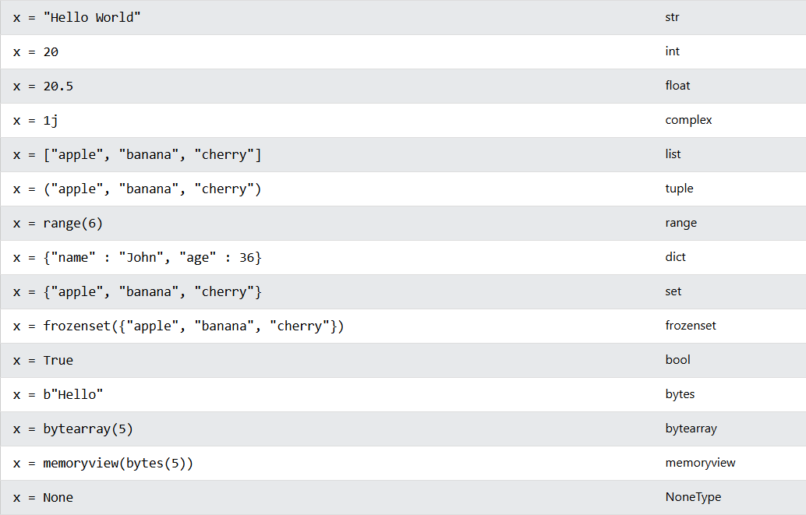

# Variáveis

Assim como js (java script) , python usa um sistema de autoavaliação do tipo de dado, não sendo necessaria a declaração

*em python '#' indica um comentário

```
a = 10                 # int
b, c = "Carro", 13.5   # string, float

```
<br>

# Tipos de dados

A biblioteca nativa do python conta com diversos tipos de dados, cada um tem sua própria função dentro do código.


*imagem retirada de [link](https://www.w3schools.com/python/python_datatypes.asp)
# Cast (conversão de dados)

A biblioteca nativa do python, também conta com recursos para a conversão dos tipo de dados (cast).

```
variavel = 10                # variavel é um inteiro que armazena 10
variavel = float(variavel)   # agora variavel é um float que armazena 10.0                            

```
<br>

Alguns comandos de cast são:
```
int()    #int
float()  #float
str()    #string
bool()   #bool
```
<br>

## Um caso onde o uso do cast é essencial:

exemplo de erro comum:
```
x = input()
x = x * x
print(x)

```
<br>

#### Consegue encontrar o problema neste código? 

#### Por padrão, a função input() retorna as informações em formato de string, impossibilitando a realização de operações aritméticas, tornando o uso do cast fulcral para esta operação.
<br>

código corrigido:
```
x = input()
x = int(x)
x = x * x
print(x)

```
<br>
<br>

[Próxima página](<4. operadores aritméticos, lógicos e comparativos em python.mdd>)
[sumário](<../>)
[Pagína anterior](<2. leitura e escrita em python.md>)
