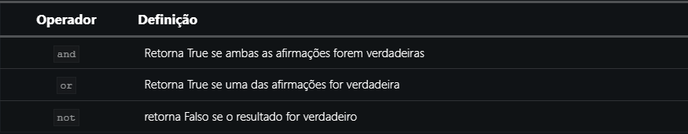
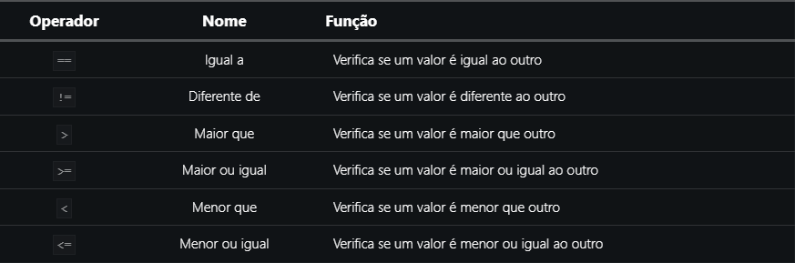

# Operadores

São os símbolos e caracteres responsáveis por abstrair a lógica a ser implementada.

## Operadores Aritméticos

 
*imagem retirada de [link](<https://pythonacademy.com.br/blog/operadores-aritmeticos-e-logicos-em-python>)

## Operadores Lógicos

 
*imagem retirada de [link](<https://pythonacademy.com.br/blog/operadores-aritmeticos-e-logicos-em-python>)

## Operadores de Comparação

 
*imagem retirada de [link](<https://pythonacademy.com.br/blog/operadores-aritmeticos-e-logicos-em-python>)
 

[Próxima página](<5_estruturas_condicionais_em_python.md>)
[sumário](<python_sumario.md>)
[Pagína anterior](<3_tipos_de_dados_e_cast_em_python.md>)
