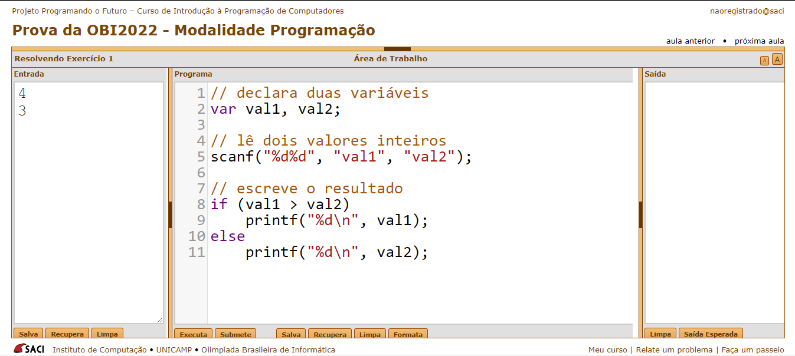

# SACI

Utilizaremos o SACI, ambiente online interpretador de JavaScript próprio da OBI(Olimpíada Brasileira de Informática).

JavaScript não possui uma maneira fácil de ler dados, pois originalmente ele é feito para receber dados de caixas de texto, pois é uma linguagem originalmente WEB.
Então esse é um dos motivos para utilizarmos esse ambiente. Poderíamos executar na nossa máquina utilizando NODE, mas é mais complicado configurar.

No JavaScript variáveis têm tipos dinâmicos, então não precisamos declarar seu tipo como em linguagens tipadas, como C, C++, Pascal e etc. Declaramos variáveis com a palavra-chave **var** ou **let**.

No ambiente SACI, se precisarmos ler uma variável, ela precisa ser declarada como **var**. Apesar que **var** quase nunca é usado programando em JavaScript por ser inseguro, mas isso é necessário para o funcionamento correto da biblioteca de leitura de dados(e também em programação competitiva não nos preocupamos com a segurança do código).

## LEITURA
Utilizamos a palavra-chave **scanf("%d%f%s",*"inteiro", "real", "string"*)**.Nesse exemplo ele le 3 dados, o primeiro %d é o tipo de leitura, inteiro é a variavel aonde ela vai ser armazenada. 
- %d para ler inteiro.
- %f para ler valores reais.
- %s para ler strings.

# ESCRITA
Utilizamos a palavra-chave **printf("%d\n", *inteiro*)**. %d é o tipo de dados que iremos escrever, inteiro é a variável que será escrita.

## Exemplo
