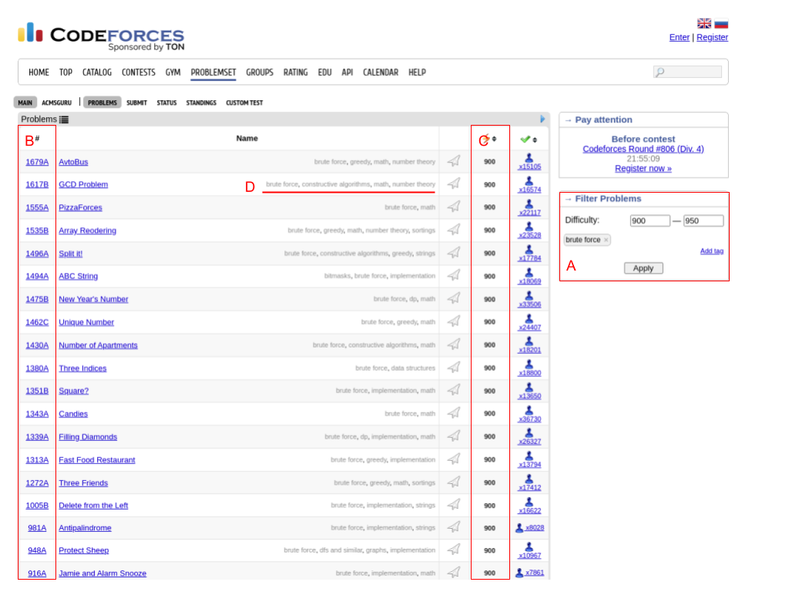
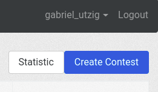
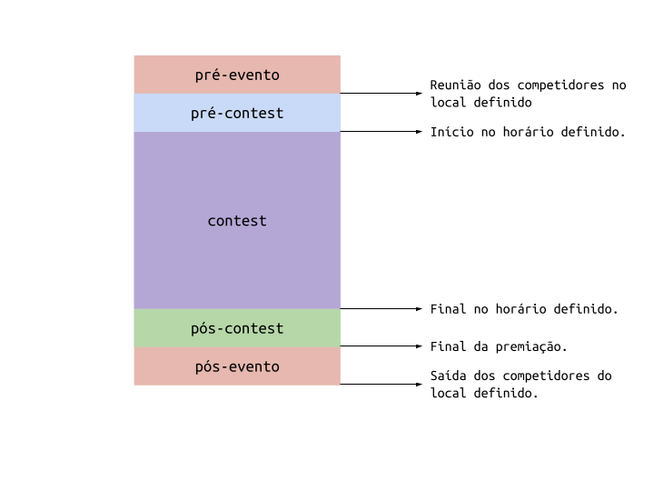
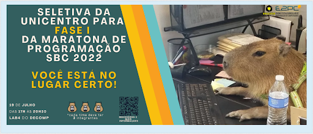
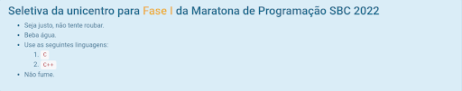

# Como organizar um contest de sucesso no Vjudge.net

### Os autores:
<div class="row">
  <div class="col-sm-6">
    <div class="card" style="width: 15rem;">
      
      <div class="card-body">
        <h5 class="card-title">Gabriel M Utzig</h5>
        <p class="card-text">Estudante de Ciência da Computação na Universidade Estadual do Centro Oeste (UNICENTRO).  Monitor do projeto E2PC (2021-2022).</p>
        <a href="https://www.linkedin.com/in/gabriel-utzig/" class="btn btn-primary"><i class="fa fa-linkedin"></i> LinkedIn</a>
      </div>
    </div>
  </div>
  <div class="col-sm-6">
    <div class="card" style="width: 15rem;">
      
      <div class="card-body">
        <h5 class="card-title">Daniel M Brasil</h5>
        <p class="card-text">Estudante de Ciência da Computação na Universidade Estadual do Centro Oeste (UNICENTRO).  Monitor do projeto E2PC (2021-2022).</p>
        <a href="https://www.linkedin.com/in/danielmbrasil/" class="btn btn-primary"><i class="fa fa-linkedin"></i> LinkedIn</a>
      </div>
    </div>
  </div>
</div>
<br/>

#### Abstract 
A successful contest is made out of a sum of factors. It does not depend only on its organizer. However, if the organizer follows these instructions they will surely be halfway there.

#### Resumo
Um contest de sucesso é feito de uma soma de fatores, e não depende apenas de seu organizador(a). Entretanto, se o organizador(a) seguir esta cartilha certamente metade do caminho já foi trilhado.

#### 1. Criar uma conta e confirmar o e-mail.
  - Para os competidores é até indicado que não sejam confirmados seus e-mails. No entanto, para o organizador do contest é preferível que seja. Com a conta confirmada, você pode comentar no contest e/ou em submissões.
  - Para os competidores basta que sejam endereços de e-mails válidos.
  
#### 2. Definir o Problem set
  - Esta etapa fica a gosto do organizador, e vai depender do nível esperado dos competidores e tempo de prova;
  - A invariável em relação a esse passo é a fonte dos problemas, recomendamos fortemente o codeforces.com. Além de ser o OJ com a maior variedade de problemas;
  - A definição dos problemas é facilitada no VJudge por meio de uma tabela com os seguintes atributos: Fonte, número do problema, peso e apelido;
  - Fonte: neste é definido o OJ de onde o problema foi retirado, por exemplo: “CodeForces”.
  - Número do problema: Cada OJ dá códigos aos seus problemas, no caso do Code Forces, é um número de 1 a 5 dígitos e uma letra, por exemplo: 256A, 3B, 1111A; 
  - Peso: Nas maratonas os pesos dos problemas não mudam, são sempre os mesmos. Nesse caso recomendamos que para todos os problemas esse valor seja 1;
  - Apelido: Este é o atributo mais importante para garantir o sucesso de um contest. É onde você, organizador(a) do evento, pode alterar o nome do problema, deixando a competição muito mais divertida;
  - Segue um exemplo de uma tabela de problemas com os atributos na ordem supracitada:
  - ```
CodeForces	|	834A	|	1	|	Spinner blend
CodeForces	|	820B	|	1	|	Sólidos de platão
CodeForces	|	43A	|	1	|	neymar & cia
CodeForces	|	805A	|	1	|	Real ou feiki?!
CodeForces	|	1526B	|	1	|	ódio por números
CodeForces	|	762B	|	1	|	xbox ou polystation?
```
  - Observe que as colunas são separadas pelo caracter pipe “`|`”;
  - Para selecionar os problemas acesse codeforces.com/problemset; 
  - No item **A** é possível filtrar por dificuldade (problemas 800 são muito fáceis e problemas acima de 2000 são bem difíceis) e por tags;
  - O item **B** mostra o código/número do problema, esse número deverá ser salvo para a tabela;
  - No item **C** está a dificuldade dos problemas, é possível ordenar de forma crescente ou decrescente;
  - O item **D** mostra as tags que aquele problema possui.

#### 3. Regras
  - Vamos discorrer sobre a preparação de um contest. Olhando o conjunto de regras é possível prever o sucesso do evento ou o oposto. Nessa etapa não há espaço para imaginação e criatividade, deve ser definido um conjunto de regras simples e efetivo, que cubra qualquer incidente e não dê margem para competidores iníquos;
  - Um contest sempre terá a cara de seu organizador(a), portanto é justo que este conjunto de regras seja reutilizado em contests futuros;
  - Um bom conjunto de regras contém informações sobre:
    - i. Comportamento no laboratório.
    - ii. Utilização dos computadores.
    - iii. Descrição das punições.
    - iv. Procedimento para dúvidas durante o contest.
    - v. Método de decisão do vencedor.
    - vi. Regulamento da premiação.
  - Recomenda-se que essas regras sejam divulgadas na descrição do contest.

#### 4. Criar um contest
  - Em [vjudge.net/contest](https://vjudge.net/contest) clique em “Create Contest”; 

  <div class="d-flex justify-content-center" ></div>

  - Nesta etapa, você, organizador(a) terá que definir os atributos do contest, são eles: Tipo, visibilidade, senha, título, data de início, duração, histórico, regras do ranking, peer status, submissão manual, banner, descrição e Problem Set;
  - **Tipo**: recomendamos, para contests presenciais, a opção Classical Contest. Neste caso será uma conta por equipe. Já para o modo virtual, pode-se usar o tipo group contest;
  - **Visibilidade**: recomendamos a visibilidade “Private - only users knowing contest password can see and submit”. No entanto, a visibilidade “Protected - any one can see, but only users knowing contest password can submit”  não seria uma má escolha. Fica a critério do organizador(a);
  - **Senha**: neste campo é importante que o organizador(a) seja criativo, inventando uma senha que possua os seguintes 3 pilares:
    - i. Facilidade de digitação - a senha será possivelmente divulgada verbalmente ou via quadro branco para os competidores, portanto, ela  deve ser de fácil digitação para evitar problemas.
    - ii. Criatividade - a senha não deve ser tosca, alguns péssimos exemplos são: seletiva@e2pc22, seletivaunicentro2022, boasorteatodos=). Exemplos excelentes são: calvice_tipo_m, droga!_esqueci_meu_bronzeador, hoplobatrachus_tigerinus.
    - iii. Imprevisibilidade - a senha não  deveria conter palavras óbvias, como e2pc, seletiva ou unicentro. Os competidores devem sempre se surpreender com a revelação da senha.
    Título: neste campo, o organizador(a) não precisa ser criativo, seja sucinto e burocrata. Exemplo: Seletiva UNICENTRO para Maratona de Programação ICPC 2022; 
  - **Data de Início**:  deve ser definida a data e hora de início da prova. Neste campo a palavra é ATENÇÃO, tente não errar;
  - **Duração**: neste campo a duração do contest é dada em HH:MM:SS, a decisão aqui fica a vontade do organizador(a). Ressaltamos a importância da coerência na relação Tempo / Número de Problemas / Dificuldade;
  - **Histórico**: recomendamos a opção “Hide until contest ends”. Mesmo que não faça diferença para os competidores que estarão utilizando contas recém criadas;
  - **Regras do ranking**: recomendamos a opção “Standard ICPC”. No entanto para contests muito longos (maiores que 8h) ou muito curtos (menores que 2h) o valor da penalidade deve ser alterado de acordo com o tempo de contest;
  - **Peer status**: recomendamos a opção “Display”, pois é a opção definida em contests oficiais ICPC, no entanto fica a critério do organizador(a). Este atributo decide se é possível visualizar o status das submissões das equipes adversárias;
  - **Submissão manual**: recomendamos o valor “If Necessary”. O VJudge utiliza contas bots nos OJs para submeter os problemas. Em casos específicos pode haver problemas nesse processo, no entanto, se o organizador(a) seguir a recomendação de utilizar apenas problemas do Codeforces, dificilmente terá problemas;
  - **Banner**: o banner dos contests aceita Markdown. Veja os exemplos no tópico 6;
  - **Descrição**: este campo também aceita Markdown, recomendamos que seja utilizado. Em relação ao conteúdo, recomendamos uma descrição breve sobre as regras e informações sobre solicitação de ajuda aos organizadores;
  - **Problem Set**: com a seleção feita (descrito no passo 2), clique no ícone de edição e cole a tabela de problemas; 
  - Ok, pode clicar em “Confirm”. Seu contest está definido!
  - Caso precise alterar alguma coisa clique em “Update”. 
  - As opções de “settings” ficam a decisão dos participantes. Instrua a manter o padrão.
  
#### 5. Gerenciar o contest
  - Como organizador(a) do contest seu trabalho apenas começou, suas responsabilidades só acabam quando todos os competidores forem embora. Vamos falar um pouco sobre elas:
  - Um contest é dividido como consta na Figura 1.
    - i. **Pré-evento**
      - Divulgação do evento
      - Controle de qualidade dos nomes dos times (pode ser solicitada a ajuda dos monitores).
      - Criação das contas para os times.
      - Seleção de problemas
      - Criação do contest
    - ii. **Pré-contest**
      - Preparar as máquinas utilizadas (bloqueio DNS).
      - Organizar os times no(s) laboratório(s).
      - Instruções gerais.
      - Abertura para dúvida dos competidores.
      - Divulgação da senha e link do contest.
    - iii. **Durante o contest**
      - Monitorar a página do contest, isso inclui a caixa de comentários, os status das submissões e o ranking.
      - Relacionado ao primeiro tópico, é indicado que o organizador(a) do evento analise, eventualmente, os códigos submetidos procurando por eventual trapaça.
      - Monitorar comportamento suspeito dos participantes.
      - Entregar os balões para as equipes que submetem corretamente os problemas.
      - Relembrar os competidores que o tempo está passando.
      - Anunciar o fim da prova, tal como a equipe vencedora.
    - iv. **Pós-contest**
      - Parabenizar os competidores.
      - Anunciar o próximo evento.
      - Anunciar e premiar a equipe vencedora.
    - v. **Pós-evento**
      - Certificar-se que todos os competidores tenham ido embora.
      - Desativar o bloqueio de DNS das máquinas.
      - Executar ou solicitar o procedimento padrão de fechamento do(s) laboratório(s).

<div class="d-flex flex-column align-items-center justify-content-center" ><p class="text-md-center" ><b>Figura 1</b> - Divisão de um contest.<br/><b>Fonte</b>: Os autores.</p></div>

#### 6. Exemplos
  - Um contest exemplo foi criado e está disponível em: [vjudge.net/contest/503787](https://vjudge.net/contest/503787).
  - **Banner**: O banner aceita Markdown e HTML, portanto é possível utilizá-lo de várias formas.
    - i. Inserindo uma imagem:

      | ``  |
      | --- |
      |  |

    - ii. O site permite a inserção de HTML, portanto é possível escapar os limites do banner facilmente com as próprias classes CSS do site. Nesse exemplo inserimos uma imagem do Messi Careca no canto superior esquerdo do contest:

      | `### Seletiva da unicentro para Fase I da Maratona de Programação SBC 2022 ` |
      | --- |
      |  |

    - iii. O método mais simples e mais efetivo é utilizando o Markdown + HTML. Nesse exemplo é um banner com informações relevantes para a prova e com classes css (para mudar a cor da “Fase I”). 

      | ```### Seletiva da unicentro para <span class="btn-outline-warning"> Fase I </span>da Maratona de Programação SBC 2022 - Seja justo, não tente roubar. - Beba água. - Use as seguintes linguagens: 1. `C` 2. `C++` - Não fume.` ```|
      | --- |
      |  |
  - **Descrição**: A descrição é variável de acordo com o organizador(a) e o evento, portanto segue um template
    - ```
    ### Regras
      i. Proibido utilização de qualquer meio de comunicação com o mundo exterior. É apenas permitido comunicação entre o time. 
      ii. Proibido a utilização de tabaco e/ou qualquer tipo de bebida alcoólica durante o _contest_.
      iii. Proibido acessar qualquer outro website que não seja o contest no vjudge. 
      iv. Proibido baderna.
      v. Cada time pode usar apenas um PC
      vi. Material impresso pode ser consultado (livros, códigos impressos, caderno de programação, estrutura de dados, grafos, etc). É Também é recomendado o uso de permitido rascunho.
      . Manter a organização do espaço do time durante e após o contest.

      ### Submissões
      Deve ser feito submissões nas seguintes linguagens: `C`, `C++`, `Python3`, `Java`.
      **Para compilar em ... use ...**
      `C`  → `GNU GCC C11 5.1.0`
      `C++`  → `GNU G++17 7.3.0` 
      `Python3`  → `Python 3.8.10` 
      `Java`  → `Alt + F4`

      ### Ajuda da organização
      O procedimento para pedir ajuda da organização do contest é:
        1. Levantar a mão.
        2. Pedir ajuda.
        3. Esperar pelo organizador(a).


      ### Premiação
      Serão premiados os times melhores colocados no ranking ao final da competição.
      Os prêmios são:
      **1º Lugar** - Seleção para representar a UNICENTRO na fase regional da maratona ICPC 2022 + 5x vale chope no km.
      **2º Lugar** - Seleção para representar a UNICENTRO na fase regional da maratona ICPC 2022 + 5x vale chope no zero hora.
      **3º Lugar** - Seleção para representar a UNICENTRO na fase regional da maratona ICPC 2022 
      **4 - 100º Lugar**- Parabéns pela participação. 
    ```
    - Resultado: 
    ### Regras
      i. Proibido utilização de qualquer meio de comunicação com o mundo exterior. É apenas permitido comunicação entre o time. 
      ii. Proibido a utilização de tabaco e/ou qualquer tipo de bebida alcoólica durante o _contest_.
      iii. Proibido acessar qualquer outro website que não seja o contest no vjudge. 
      iv. Proibido baderna.
      v. Cada time pode usar apenas um PC
      vi. Material impresso pode ser consultado (livros, códigos impressos, caderno de programação, estrutura de dados, grafos, etc). É Também é recomendado o uso de permitido rascunho.
      . Manter a organização do espaço do time durante e após o contest.

      ### Submissões
      Deve ser feito submissões nas seguintes linguagens: `C`, `C++`, `Python3`, `Java`.

      **Para compilar em ... use ...**

      `C`  → `GNU GCC C11 5.1.0`

      `C++`  → `GNU G++17 7.3.0` 

      `Python3`  → `Python 3.8.10` 

      `Java`  → `Alt + F4`

      ### Ajuda da organização
      O procedimento para pedir ajuda da organização do contest é:
        1. Levantar a mão.
        2. Pedir ajuda.
        3. Esperar pelo organizador(a).


      ### Premiação
      Serão premiados os times melhores colocados no ranking ao final da competição.
      Os prêmios são:
      **1º Lugar** - Seleção para representar a UNICENTRO na fase regional da maratona ICPC 2022 + 5x vale chope no km.
      **2º Lugar** - Seleção para representar a UNICENTRO na fase regional da maratona ICPC 2022 + 5x vale chope no zero hora.
      **3º Lugar** - Seleção para representar a UNICENTRO na fase regional da maratona ICPC 2022 
      **4 - 100º Lugar**- Parabéns pela participação.
      