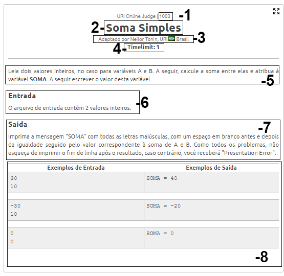
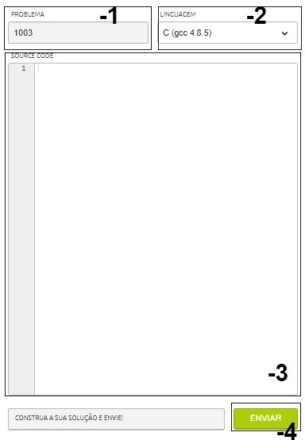

# Sistemas automáticos de avaliação
Durante esse projeto haverá diversas atividades sugeridas para fixar e colocar em prática os conteúdos aqui estudados. Tanto para a leitura quanto para a avaliação da resolução das atividades serão utilizado dois sites: o [Uri](https://www.beecrowd.com.br/judge/en/login) e o site da [OBI](https://olimpiada.ic.unicamp.br/)

# [Uri](https://www.beecrowd.com.br/judge/en/login)

A URI Online Judge é um projeto desenvolvido pelo departamento de ciência da computação da universidade URI. Esse portal apresenta um repositório com diversos problemas com diversos níveis de dificuldades para serem resolvidos por meio da programação.

Antes de iniciar as atividades, é necessário se cadastrar no site.

## Anatomia de um problema URI



### 1 - Numero
Esse numero é o numero referente ao problema, é ele quem identifica qual é o problema na hora de enviar a resolução para avaliação. Você também consegue acessar a pagina referente ao problema com esse numero nesse formato.

```
https://www.urionlinejudge.com.br/judge/pt/problems/view/NUMERO/
```

Por exemplo:
```
//Pagina da URI referente ao problema "Soma Simples - 1003"
https://www.urionlinejudge.com.br/judge/pt/problems/view/1003/
```

### 2 - Nome
Essa área é reservada ao nome do problema.

### 3 - Autor
Esse área é reservada aos dados de quem postou o problema.

### 4 - Tempo Limite
Ao realizar a correção do seu código, o próprio sistema irá inserir os dados e analisar os resultados obtidos. Por mais que seu código responda corretamente, os problemas tem um "tempo limite" de execução, então se seu código processar e responder mais lentamente que o limite estabelecido no problema o código será considerado incorreto. Porem esse não é um problema que quem está iniciando deve se preocupar, pois seu código raramente irá encontrar esse problema.

### 5 - Contexto
Essa área é onde há a contextualização do problema, geralmente uma história ou explicação lúdica de pra que o seu sistema está sendo feito.

### 6 - Entrada
Área responsável por explicar quais serão as entradas do seu programa, o tipo e o formato que seu código deve ler. Se o seu código não ler os dados como essa área indica o sistema não conseguirá inserir os dados corretamente, o que levará a falha na avaliação. São pouquíssimos os problemas que não exigem entradas.

### 7 - Saída
Área responsável por explicar qual será a saída do seu programa e como deverá ser formatada. Por mais que seu sistema esteja processando os dados corretamente é preciso apresentar os dados *exatamente* como estão sendo definidos, com o exato numero de espaços e símbolos que estão sendo indicados. Lembre-se que quem está avaliando é um outro código, então se a saída do seu código não estiver formatado da forma que o problema pede o código avaliador não conseguirá entender.

### 8 - Exemplos
Essa área é responsável por mostrar alguns exemplos de entradas e saídas referentes a aquelas entradas. Também funciona como um tira duvidas quanto a formatação da entrada e saída do programa.


### Dicas
A área de entrada (6) e saída (7) são as mais importantes e que mais necessitam de atenção pois são elas que descrevem a parte prática de como deve funcionar e o que seu código deve responder. Então preste o dobro de atenção nessas duas áreas.

Um dos erros mais comuns é o "Presentation error" ou "Erro de apresentação", significa que o sistema de avaliação não entendeu as saídas do seu código, então sempre verifique se a saída do seu código está formatada como indicado. Se a formatação estiver correta e mesmo assim o sistema continuar indicando esse erro, se seu código quebra a linha depois de apresentar. Por exemplo:

Códigos sem quebrar a linha.

#### Pascal
```
write("um");
write("dois");
write("três");

saída do código:
umdoistrês
```
```
printf("um");
printf("dois");
printf("três");

saída do código:
umdoistrês
```

Códigos quebrando a linha.

#### Pascal
```
writeln("um");
writeln("dois");
writeln("três");

saída do código:
um
dois
três
```
```
printf("um\n");
printf("dois\n");
printf("três\n");

saída do código:
um
dois
três
```

No caso do pascal a função "writeln" quebra a linha após apresentar a informação. Já na linguagem C usemos o "\n" após a informação dentro da função. Verifique qual a melhor forma de fazer isso na sua linguagem escolhida.

### Enviando o código para avaliação

No site da URI, logo ao lado da apresentação do problema, existe uma area para enviar seu código para a avaliação.


#### 1 - Identificação
Nesse campo há a identificação do problema que o código solucionará.

#### 2 - Linguagem
Nesse campo você deve selecionar em qual linguagem você escreveu o código que irá enviar para analise.

#### 3 - Código
Aqui você deve colar o código que escreveu para resolver o problema, incluindo as bibliotecas utilizadas. Não é recomendado escrever o código diretamente nessa área pois você pode perde-lo. Recomenda-se um editor onde você pode salvar e testar os seus códigos antes de enviar.

#### 4 - Enviar
Após as etapas acima é só enviar e verificar o resultado do teste.
