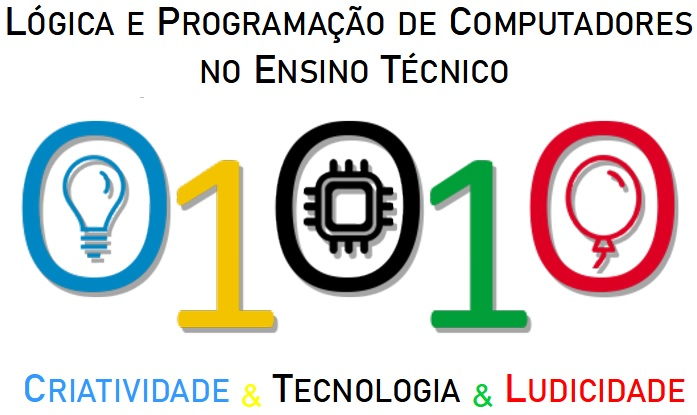

---
title: TL PC WIKI
layout: post
permalink: /wiki/
filename: wiki
button: Wiki
blocker: wiki
--- 

# Treinamento em Lógica e Programação de Computadores no Ensino Técnico

O enfoque do projeto é proporcionar treinamento para alunos do ensino técnico que possuem maior interesse em programação, sobretudo, que participam da [Olimpíada Brasileira de Informática (OBI)](https://olimpiada.ic.unicamp.br/)

# Sobre a Olimpíada Brasileira de Informática

O objetivo da [Olimpíada Brasileira de Informática (OBI)](https://olimpiada.ic.unicamp.br/) é despertar nos alunos o interesse por uma ciência importante na formação básica hoje em dia (no caso, ciência da computação), através de uma atividade que envolve desafio, engenhosidade e uma saudável dose de competição. A organização da OBI está cargo do Instituto de Computação da UNICAMP.
[SAIBA MAIS](/Olimpiada)

# Conteudo

- [Formato dos problemas](/formato_problemas)
- [Sistemas automáticos de avaliação](/sistema_automaticos)
- [Erros comuns](/erros_comuns)
- [Entrada/Saída de Dados](/entrada_saida)
- [Operadores Lógicos](/operadores_logicos)
- [Estruturas de Seleção](/estruturas_selecao)
- [Estruturas de Repetição](/estruturas_repeticao)
- [Vetores](/vetores)

# Equipe de execução

## Coordenação:
- Ana Elisa T. P. da Palma
- Mauro Miazaki

## Equipe:
- Alexandro Luis da Rocha Junior
- Eric Patrick Militão
- João Vitor Pieczarka da Silva
- Gabriel Utzig
- Daniel M Brasil
